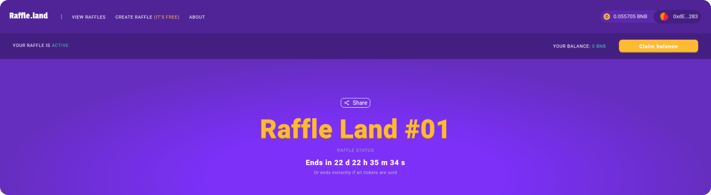

Hi there 👋

I’m a software engineer and open-source enthusiast. I wrote my first scripts for fun on the IRC network when I was 12 years old. Ever since, I've fallen in love with this digital world. I consider myself to be a self-learner who's passionate about the technology I work with. I’ve explored different areas such as affiliated marketing, digital courses and the financial market. Therefore I'm always looking to further develop my skills through application.

### 💖 Technologies

### 💻 Languages

### 🗃️ Databases

### ☁️ Cloud

### 🌐 Virtualization

## Last project

### Raffle Land

[Raffle Land](https://raffle.land/) is a dapp where everyone can easily create a raffle in blockchain

